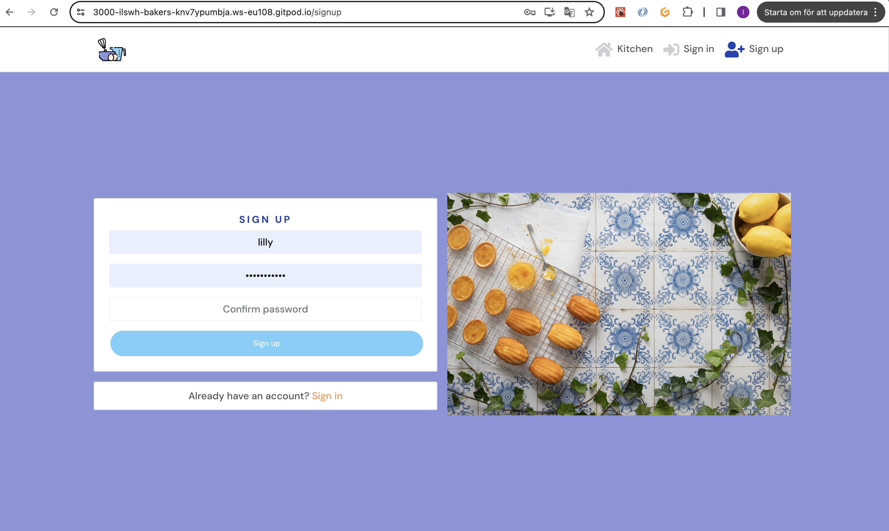
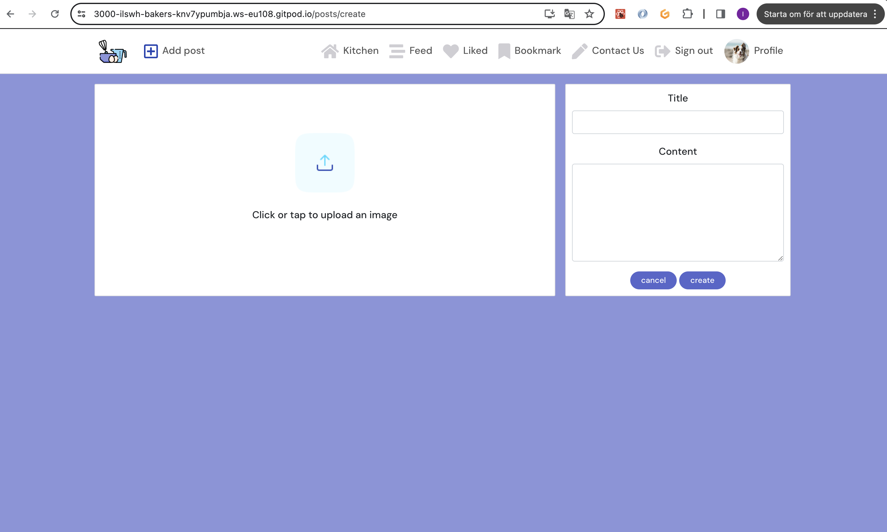
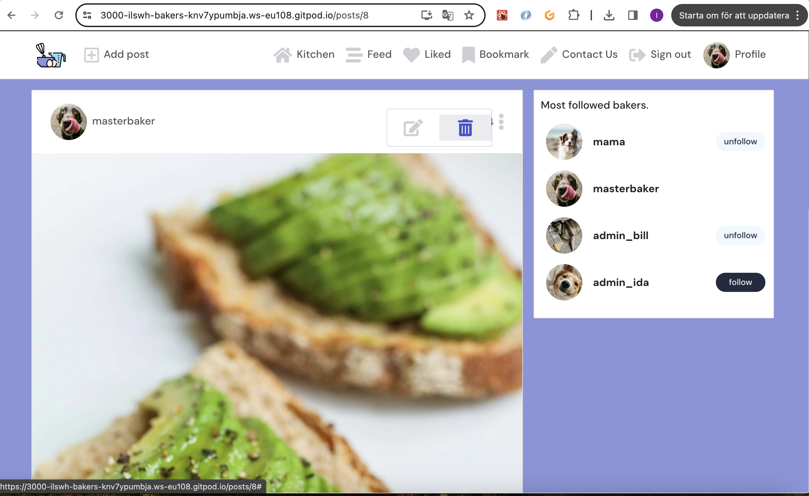
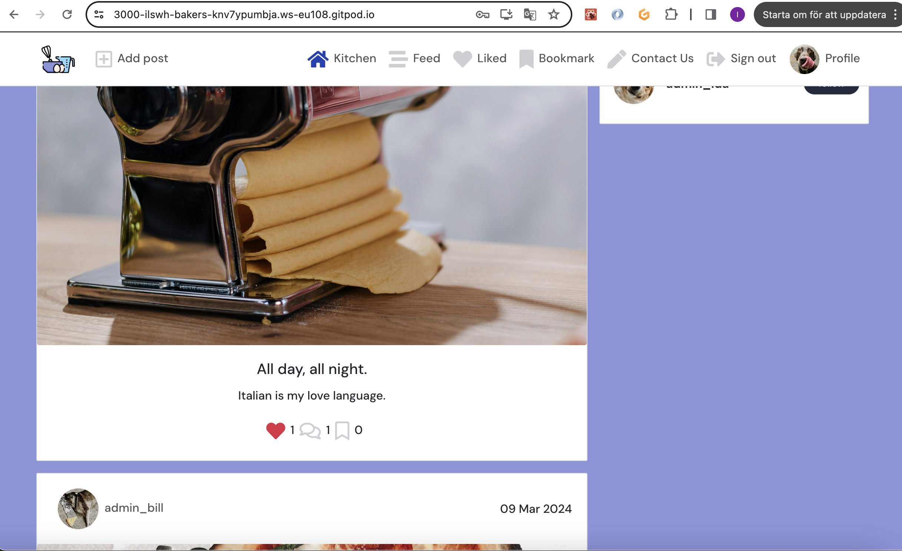
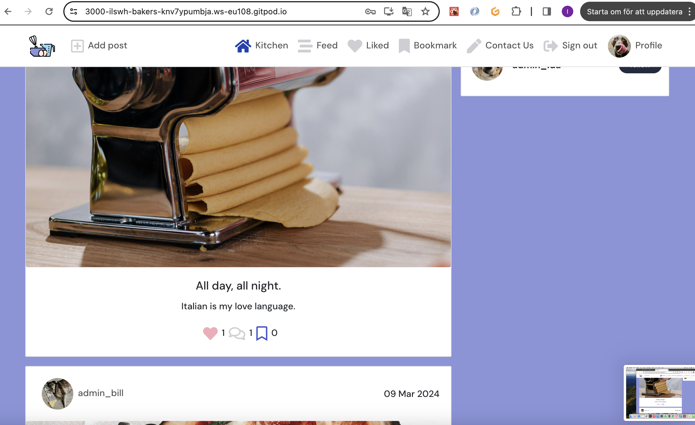
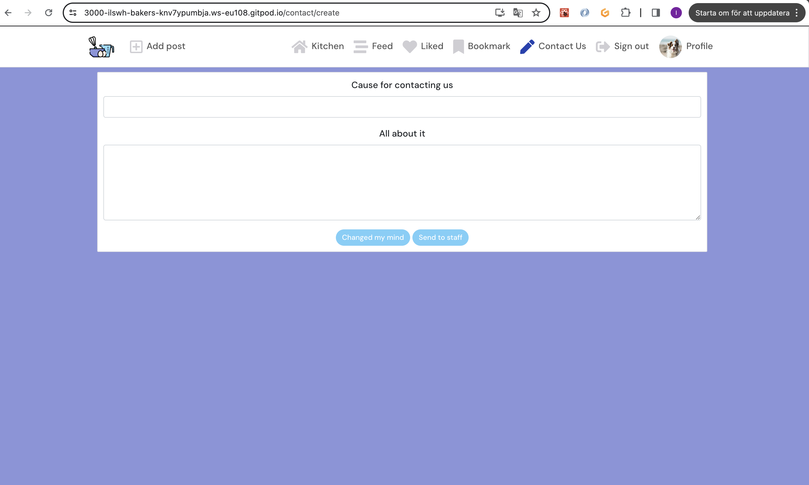
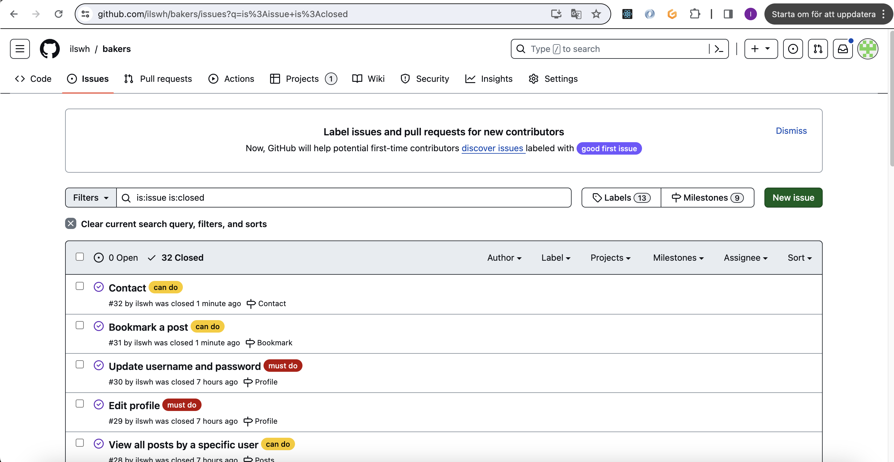

# [BAKERS](https://bakers-d9795fbf4027.herokuapp.com/)

Bakers is a social media with where users can, post, like, bookmark, comment, follow other users & contact admin. Bakers target audience is people who love to bake and eat baked goods and share and connect that with alike souls. My hope is that bakers accomplishes that.

https://ui.dev/amiresponsive?url=https://bakers-d9795fbf4027.herokuapp.com/


## UX

My design proccess started when I found an logo and favicon I wanted to use for the site. I decided to implement the colors from the logo all over the site and the colors from the favicon on the like button.

### Colour Scheme

The colors I used derives from the logo and favicon. Generated by [coolors.co](https://coolors.co/e84610-009fe3-4a4a4f-445261-d63649-e6ecf0-000000)


### Typography

I used fonts suited for the web ux.

- [DM Sans](https://fonts.google.com/specimen/DM+Sans) was used for all text with a fallback on sans-serif.

- [Font Awesome](https://fontawesome.com) icons were used throughout the site, such as the social media icons in the footer.

## User Stories

Below you can see the user stories of new & returning site users together followed by the admins.

### New Site Users

- As a new site user, I would like to see all posts on the homepage, so that I can decide if I want to sign up.
- As a new site user, I would like to sign up, so that I can join the bakers community.

### Returning Site Users

- As a returning site user, I would like to see all posts on the homepage, so that I can see what bakers community is sharing.
- As a returning site user, I would like to sign in, so that I can do everything availible on bakers.
- As a returning site user, I would like to sign out, so that I can keep my account private and safe.
- As a returning site user, I would like to add a post, so that I can share my baked news.
- As a returning site user, I would like to edit a post, so that I can fix mistakes I made.
- As a returning site user, I would like to delete a post, so that I can change my mind about posting.
- As a returning site user, I would like to like a post, so that I can show my appreciation.
- As a returning site user, I would like to unlike a post, so that I can change my mind about liking.
- As a returning site user, I would like to bookmark a post, so that I can go back to a post easily.
- As a returning site user, I would like to unbookmark a post, so that I can change my mind about a bookmark.
- As a returning site user, I would like to comment on posts, so that I can share my thought and opinions.
- As a returning site user, I would like to edit a comment, so that I can fix mistakes I made.
- As a returning site user, I would like to delete a commment, so that I can change my mind about a comment I wrote.
- As a returning site user, I would like to follow a user, so that I can see their posts frequently on feed.
- As a returning site user, I would like to unfollow a user, so that I can stop seeing them on my feed.
- As a returning site user, I would like to unfollow a user, so that I can stop seeing them on my feed.
- As a returning site user, I would like to view my profile, so that I can see how many I follow and are following and how many and what posts I have made.
- As a returning site user, I would like to view other users profile, so that I can see how many they follow and are following and how many and what posts they have made.
- As a returning site user, I would like to be able to edit my profile, so that I can keep it updated as I change.
- As a returning site user, I would like to be able to edit my bakerusername, so that I can keep it updated as I change.
- As a returning site user, I would like to be able to edit my password, so that I be safe.

### Site Admin

- As a site administrator, I should be able to delete a user, so that I can keep a happy healtyh community.

## Features

Below you can see all of bakers features. Starting with the existing followed by the future.

### Existing Features

- **Kitchen**

    - The kitchen on bakers acts as a homepage because the heart is the home of any bakers house. Here you can scroll through all posts with a infinity scroll, but only like, comment & bookmark if you are logged in.


- **Sign in**

    - When clicking on sign in the nav-bar in you sign in you get redirected to a form to sign in. If you are not registered there is a orange-yellow text to redirect you so that you can register as user.


- **Sign up**

    - When clicking on sign up the nav-bar you get redirected to a form to users sign up, choosing a bakerusername and a password written two times to make sure there is no mistakes in the first or second password. If you are already registered there is a orange-yellow text to redirect you so that you can sign in.



- **sign out**

    - In order for a safe user experience, users can always choose to log out by clicking on logout.


- **View post**

    - Al signed in users can view a post by clicking on it.


- **Add post**

    - Al signed in users can add a post with a picture, heading and text by clicking on the plus icon.



- **Edit post**

    - Users can edit their own posts by clicking at the dropdown menu at chosen post and there click edit. From there they get redirected to a form for editing and saving post.


- **Delete post**

    - Users can edit their own posts by clicking at the dropdown menu at chosen post and there click delete. After clicking delete a window pops up to make sure they want to delete the post in question.



- **Feed**

    - When clicking on feed with three horizontal lines that is not in order you can view posts of only people you follow.


- **Follow & unfollow**

    - On the right hand side of bakers you can see the most followed bakers and choose to follow and unfollow by clicking on a button. You can go to their profile by clicking on their avatar.


- **Like & unlike**

    - Under each post all signed in users can click on the heart to like but also unlike if you changed your mind or made a mistake by clicking on the heart again. Users can not like their own post. If clicking on the heart in nav-bar you can see all your likes.





- **Comment**

    - All signed in users comment on their own and other users posts by clicking on the talking bubbles.


- **Edit comment**

    - Users can edit their own comment by clicking at the dropdown menu at chosen post and there click edit. From there they get redirected to a form for editing their comment


- **Delete comment**

    - Users can delte their own comments by clicking at the dropdown menu at chosen comment and there click delete. After clicking delete a window pops up to make sure they want to delete the comment in question.


- **Bookmark & unbookmark**

    - Under each post all signed in users can click on the bookmark to bookmark but also unbookmark if you changed your mind or made a mistake by clicking on the bookmark again. Users can not bookmark their own post. If clicking on the bookmark in nav-bar you can see all your bookmarks.




- **Contact us**

    - All signed in users can contact us staff by clicking on the pen in the navbar. From there they get redirected to a form which they can fill in and send to us or change their mind by clicking on the "changed my mind" button.



- **Profile**

    - When clicking on your own avatar you can see your how many post you made and all your posts. Also who you follow & are following.


- **Edit Profile**

    - When clicking on the dropdown menu at your profile, you can edit your profile or your bakerusername and password.


### Future Features

- Messages
    - Make a feature so users can message eachother privately.
- Exploding hearts.
    - When a user likes a post there will be hearts all over the the screen in the colors of the favicon.
- Contact popup
    - When a user has sent a message, comes a popup for a second, letting the user now the message has been sent.

## Tools & Technologies Used

- [HTML](https://en.wikipedia.org/wiki/HTML) used for the main site content.
- [CSS](https://en.wikipedia.org/wiki/CSS) used for the main site design and layout.
- [JavaScript](https://www.javascript.com) used for user interaction on the site.
- [Python](https://www.python.org) used as the back-end programming language.
- [Git](https://git-scm.com) used for version control. (`git add`, `git commit`, `git push`)
- [GitHub](https://github.com) used for secure online code storage.
- [GitHub Pages](https://pages.github.com) used for hosting the deployed front-end site.
- [Gitpod](https://gitpod.io) used as a cloud-based IDE for development.
- [Bootstrap](https://getbootstrap.com) used as the front-end CSS framework for modern responsiveness and pre-built components.
- [Django](https://www.djangoproject.com) used as the Python framework for the site.
- [ElephantSQL](https://www.elephantsql.com) used as the Postgres database.
- [Heroku](https://www.heroku.com) used for hosting the deployed back-end site.
- [Cloudinary](https://cloudinary.com) used for online static file storage.


## Database Design

Entity Relationship Diagrams (ERD) help to visualize database architecture before creating models.
Understanding the relationships between different tables can save time later in the project.


## Agile Development Process

### GitHub Projects

[GitHub Projects](https://github.com/ilswh/bakers/projects) served as an Agile tool for this project.
It isn't a specialized tool, but with the right tags and project creation/issue assignments, it can be made to work.

Through it, user stories, issues, and milestone tasks were planned, then tracked on a weekly basis using the basic Kanban board.


### GitHub Issues

[GitHub Issues](https://github.com/ilswh/poetic-society/issues) served as an another Agile tool.
There, I used my own **User Story Template** to manage user stories.

It also helped with milestone iterations on a weekly basis.

- [Open Issues](https://github.com/ilswh/bakers/issues)

    

- [Closed Issues](https://github.com/ilswh/bakers/issues?q=is%3Aissue+is%3Aclosed)

    

- [Milestones](https://github.com/ilswh/bakers/milestones)

    

### MoSCoW Prioritization

I've decomposed my Epics into stories prior to prioritizing and implementing them.
Using this approach, I was able to apply the MoSCow prioritization and labels to my user stories within the Issues tab.

- **Must Have**: guaranteed to be delivered (*max 60% of stories*)
- **Should Have**: adds significant value, but not vital (*the rest ~20% of stories*)
- **Could Have**: has small impact if left out (*20% of stories*)
- **Won't Have**: not a priority for this iteration

## Testing

For all testing, please refer to the [TESTING.md](TESTING.md) file.

## Deployment

The live deployed application can be found deployed on [Heroku](https://bakers-d9795fbf4027.herokuapp.com/).

### ElephantSQL Database

This project uses [ElephantSQL](https://www.elephantsql.com) for the PostgreSQL Database.

To obtain your own Postgres Database, sign-up with your GitHub account, then follow these steps:

- Click **Create New Instance** to start a new database.
- Provide a name (this is commonly the name of the project: poetic-society).
- Select the **Tiny Turtle (Free)** plan.
- You can leave the **Tags** blank.
- Select the **Region** and **Data Center** closest to you.
- Once created, click on the new database name, where you can view the database URL and Password.

### Cloudinary API

This project uses the [Cloudinary API](https://cloudinary.com) to store media assets online, due to the fact that Heroku doesn't persist this type of data.

To obtain your own Cloudinary API key, create an account and log in.

- For *Primary interest*, you can choose *Programmable Media for image and video API*.
- Optional: *edit your assigned cloud name to something more memorable*.
- On your Cloudinary Dashboard, you can copy your **API Environment Variable**.
- Be sure to remove the `CLOUDINARY_URL=` as part of the API **value**; this is the **key**.

### Heroku Deployment

This project uses [Heroku](https://www.heroku.com), a platform as a service (PaaS) that enables developers to build, run, and operate applications entirely in the cloud.

Deployment steps are as follows, after account setup:

- Select **New** in the top-right corner of your Heroku Dashboard, and select **Create new app** from the dropdown menu.
- Your app name must be unique, and then choose a region closest to you (EU or USA), and finally, select **Create App**.
- From the new app **Settings**, click **Reveal Config Vars**, and set your environment variables.

| Key | Value |
| --- | --- |
| `CLOUDINARY_URL` | user's own value |
| `DATABASE_URL` | user's own value |
| `DISABLE_COLLECTSTATIC` | 1 (*this is temporary, and can be removed for the final deployment*) |
| `SECRET_KEY` | user's own value |

Heroku needs two additional files in order to deploy properly.

- requirements.txt
- Procfile (I had to work around this so I don't have procfile)

You can install this project's **requirements** (where applicable) using:

- `pip3 install -r requirements.txt`

If you have your own packages that have been installed, then the requirements file needs updated using:

- `pip3 freeze --local > requirements.txt`

The **Procfile** can be created with the following command:

- `echo web: gunicorn app_name.wsgi > Procfile`
- *replace **app_name** with the name of your primary Django app name; the folder where settings.py is located*

For Heroku deployment, follow these steps to connect your own GitHub repository to the newly created app:

Either:

- Select **Automatic Deployment** from the Heroku app.

Or:

- In the Terminal/CLI, connect to Heroku using this command: `heroku login -i`
- Set the remote for Heroku: `heroku git:remote -a app_name` (replace *app_name* with your app name)
- After performing the standard Git `add`, `commit`, and `push` to GitHub, you can now type:
	- `git push heroku main`

The project should now be connected and deployed to Heroku!

### Local Deployment

This project can be cloned or forked in order to make a local copy on your own system.

For either method, you will need to install any applicable packages found within the *requirements.txt* file.

- `pip3 install -r requirements.txt`.

You will need to create a new file called `env.py` at the root-level,
and include the same environment variables listed above from the Heroku deployment steps.

Sample `env.py` file:

```python
import os

os.environ.setdefault("CLOUDINARY_URL", "user's own value")
os.environ.setdefault("DATABASE_URL", "user's own value")
os.environ.setdefault("SECRET_KEY", "user's own value")

# local environment only (do not include these in production/deployment!)
os.environ.setdefault("DEBUG", "True")
```

Once the project is cloned or forked, in order to run it locally, you'll need to follow these steps:

- Start the Django app: `python3 manage.py runserver`
- Stop the app once it's loaded: `CTRL+C` or `⌘+C` (Mac)
- Make any necessary migrations: `python3 manage.py makemigrations`
- Migrate the data to the database: `python3 manage.py migrate`
- Create a superuser: `python3 manage.py createsuperuser`
- Load fixtures (if applicable): `python3 manage.py loaddata file-name.json` (repeat for each file)
- Everything should be ready now, so run the Django app again: `python3 manage.py runserver`

#### Cloning

You can clone the repository by following these steps:

1. Go to the [GitHub repository](https://github.com/ilswh/poetic-society) 
2. Locate the Code button above the list of files and click it 
3. Select if you prefer to clone using HTTPS, SSH, or GitHub CLI and click the copy button to copy the URL to your clipboard
4. Open Git Bash or Terminal
5. Change the current working directory to the one where you want the cloned directory
6. In your IDE Terminal, type the following command to clone my repository:
	- `git clone https://github.com/ilswh/poetic-society.git`
7. Press Enter to create your local clone.

Alternatively, if using Gitpod, you can click below to create your own workspace using this repository.

[](https://gitpod.io/#https://github.com/ilswh/poetic-society)

Please note that in order to directly open the project in Gitpod, you need to have the browser extension installed.
A tutorial on how to do that can be found [here](https://www.gitpod.io/docs/configure/user-settings/browser-extension).

#### Forking

By forking the GitHub Repository, we make a copy of the original repository on our GitHub account to view and/or make changes without affecting the original owner's repository.
You can fork this repository by using the following steps:

1. Log in to GitHub and locate the [GitHub Repository](https://github.com/ilswh/poetic-society)
2. At the top of the Repository (not top of page) just above the "Settings" Button on the menu, locate the "Fork" Button.
3. Once clicked, you should now have a copy of the original repository in your own GitHub account!

## Credits

When building bakers I followed the walkalong of Moments and Django REST Frameworks.
When building the contact feature I took inspiration from my mentors project and when building the bookmark feature I took inspiration from one of my mentors students. They are linked below, under content.

### Content

| Source | Location | Notes |
| --- | --- | --- |
| [Garith McGirr](https://github.com/Gareth-McGirr/body-doodles/tree/main/src/pages/contacts) | contact | Github repository (frontend) |
| [Garith McGirr](https://github.com/Gareth-McGirr/body-doodles-api/tree/main/contacts) | contact | Github repository (backend) |
| [Theresa](https://github.com/th-1982/artistery-avenue) | bookmarks | Github repository (frontend) |
| [Theresa](https://github.com/th-1982/artistery-avenue-api/tree/main/bookmarks) | bookmarks | Github repository (backend) |
| [Markdown Builder](https://tim.2bn.dev/markdown-builder) | README and TESTING | tool to help generate the Markdown files |
| [Chris Beams](https://chris.beams.io/posts/git-commit) | version control | "How to Write a Git Commit Message" |

### Media

The pictures I have used I borrowed from pexels, pixabay & unsplash. I have used tinypng to makes pictures smaller.

| Source | Location | Type | Notes |
| --- | --- | --- | --- |
| [Pexels](https://www.pexels.com) | posts + profile | images | photos for posts & profiel |
| [Pixabay](https://pixabay.com) | posts + profile | images | photos for posts & profile|
| [Unsplash](https://unsplash.com) | sign in + sign out | images | photos of baking with blue details |
| [TinyPNG](https://tinypng.com) | entire site | images | tool for image compression |

### Acknowledgements

- I would like to thank my Code Institute mentor, [Gareth McGirr](https://github.com/Gareth-McGirr) for his support throughout the development of this project.
- I would like to thank the [Code Institute](https://codeinstitute.net) tutor team for their tremendous assistance with troubleshooting and debugging some project issues.
- I would like to thank the [Code Institute Slack community](https://code-institute-room.slack.com) for the moral support; it kept me going during periods of self doubt and imposter syndrome.
- I would like to thank my family, for believing in me, and allowing me to make this transition into software development.