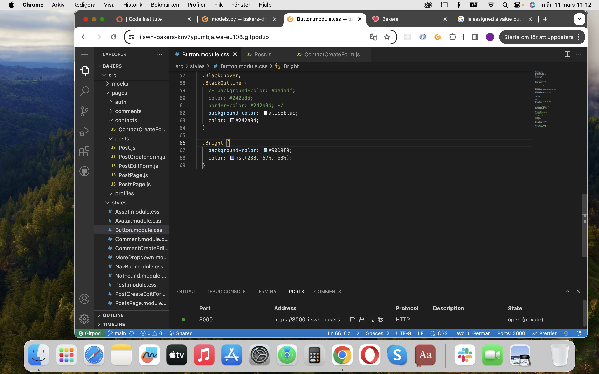

# Testing

Return back to the [README.md](README.md) file.

All features of Bakers have been tested through:
- Code validation of HTML, CSS & Python
- Browser compatability in Chrome, Firefox & Opera
- Responsiveness on mobile, tablet and desktop
- Lighthouse
- Defensive programming
-  User stories

## Code Validation

All files in Bakers have been validated through HTML, CSS and Python validators.

### HTML

I have used the recommended [HTML W3C Validator](https://validator.w3.org) to validate HTML file.

| Page | W3C URL | Screenshot | Notes |
| --- | --- | --- | --- |
| index.html | [Click](https://validator.w3.org/nu/?doc=https%3A%2F%2Fbakers-d9795fbf4027.herokuapp.com%2F) |  | Document checking completed. No errors or warnings to show. |

### CSS

I have used the recommended [CSS Jigsaw Validator](https://jigsaw.w3.org/css-validator) to validate all of my CSS files.

| File | Screenshot | Notes |
| --- | --- | --- |
| App.module.css |  | Passed with warnings |
| Asset.module.css & |  | Passed |
| Avatar.module.css & |  | Passed |
| Button.module.css |  | Passed |
| Comment.module.css & |  | Passed |
| CommentCreateEdit.module.css & |  | Passed |
| MoreDropdown.module.css & |  | Passed |
| NavBar.module.css & |  | Passed |
| NotFound.module.css & |  | Passed |
| Post.module.css & |  | Passed |
| PostCreateEdit.module.css & |  | Passed |
| PostsPage.module.css & |  | Passed |
| Profile.module.css & |  | Passed |
| ProfilePage.module.css & |  | Passed |
| SignInUpForm.css & |  | Passed |

### Python

I have used the recommended [PEP8 CI Python Linter](https://pep8ci.herokuapp.com) to validate all of my Python files.

| File | Screenshot | Notes |
| --- | --- | --- |
| bookmarks/ models.py |  | Passed |
| bookmarks/ serializers.py |  | Passed |
| bookmarks/ urls.py |  | Passed |
| bookmarks/ views.py |  | Passed |
| comments/ models.py |  | Passed |
| comments/ serializers.py |  | Passed |
| comments/ urls.py |  | Passed |
| comments/ views.py |  | Passed |
| contacts/ models.py |  | Passed |
| contacts/ serializers.py |  | Passed |
| contacts/ urls.py |  | Passed |
| contacts/ views.py |  | Passed |
| followers/ models.py |  | Passed |
| followers/ serializers.py |  | Passed |
| followers/ urls.py |  | Passed |
| followers/ views.py |  | Passed |
| likes/ models.py |  | Passed |
| likes/ serializers.py |  | Passed |
| likes/ urls.py |  | Passed |
| likes/ views.py |  | Passed |
| posts/ models.py |  | Passed |
| posts/ serializers.py |  | Passed |
| posts/ urls.py |  | Passed |
| posts/ views.py |  | Passed |
| profiles/ models.py |  | Passed |
| profiles/ serializers.py |  | Passed |
| profiles/ urls.py |  | Passed |
| profiles/ views.py |  | Passed |
| drfapi/ serializers.py |  | Passed |
| drfapi/ urls.py |  | Passed |
| drfapi/ views.py |  | Passed |
| drfapi/ permissions.py |  | Passed |
| drfapi/ settings.py |  | Line to long, did not find a good place to cut in to two lines without breaking code |
| drfapi/ wsgi.py |  | Passed |
| manage.py |  | Passed |

## Browser Compatibility

I have tested the browser compatability in the three browsers below.

- [Chrome](https://www.google.com/chrome)
- [Firefox (Developer Edition)](https://www.mozilla.org/firefox/developer)
- [Opera](https://www.opera.com/download)

I've tested my deployed project on multiple browsers to check for compatibility issues.

| Browser | Add post | Kitchen | Feed | Liked | Bookmarks | Contact Us | Sign In | Sign Up | Profile |
| --- | --- | --- | --- | --- | --- | --- | --- | --- | --- |
| Opera |   |  |  |  |  |  |  |  |  |
| Firefox |   |  |  |  |  |  |  |  |  |
| Chrome |   |  |  |  |  |  |  |  |  |

## Responsiveness

I've tested my deployed project on multiple devices to check for responsiveness issues.

| Device |  Add post | Kitchen | Feed | Liked | Bookmarks | Contact Us | Sign In | Sign Up | Profile |
| --- | --- | --- | --- | --- | --- | --- | --- | --- | --- |
| Mobile (DevTools) |  |  |  |  |  |  |  |  |  |
| Tablet (DevTools) |   |  |  |  |  |  |  |  |  |
| Desktop |   |  |  |  |  |  |  |  |  |

## Lighthouse Audit

I've tested my deployed project using the Lighthouse Audit tool to check for any major issues.

| Page | Mobile | Desktop |
| --- | --- | --- |
| Add post |  |  |
| Kitchen |  |  |
|  Feed |  |  |
| Liked |  |  |
| Bookmarks |  |  |
| Contact Us |  |  |
| Sign In |  |  |
| Sign Up |  |  |
| Profile |  |  |

## Defensive Programming

Defensive programming was manually tested with the below user acceptance testing:

| Page | Expectation | Test | Result | Fix | Screenshot |
| --- | --- | --- | --- | --- | --- |
| Add post | | | | | |
| | Feature is expected to add post. | Tested the feature by filling in information and submitting. | The feature behaved as expected, and it did add the post | Test concluded and passed |  |
| | Feature is expected to not except post when the picture or title is too big. | Tested the feature by filling in information with a too big picture & title. | The feature behaved as expected, and it did not accept the post | Test concluded and passed |  |
| Kitchen | | | | | |
| | Feature is expected to show all posts in an infinity scroll. | Tested the feature by going to kitchen and scrolling. | The feature behaved as expected, and infinity scrolled | Test concluded and passed |  |
| Feed | | | | | |
| | Feature is expected to show posts of users I follow. | Tested the feature by going to feed and going through feed. | The feature behaved as expected, and showed posts of only people I follow | Test concluded and passed |  |
| Liked | | | | | |
| | Feature is expected to show all post I've like. | Tested the feature by clicking on the heart in the navbar and looking at all posts there if I liked them. | The feature behaved as expected, and showed only posts I had liked | Test concluded and passed |  |
| | Feature is expected to add a number next to the heart icon when I click like. | Tested the feature by clicking on the heart under a post and seeing if the number added up. | The feature behaved as expected, and the number added up | Test concluded and passed |  |
| | Feature is expected to subtract a number next to the heart icon when I click unlike after having liked. | Tested the feature by clicking on the heart and seeing if the number subtracted. | The feature behaved as expected, and the number subtracted | Test concluded and passed |  |
| Bookmarked | | | | | |
| | Feature is expected to show all post I've bookmarked. | Tested the feature by clicking on the bookmark in the navbar and looking at all posts there if I bookmarked them. | The feature behaved as expected, and showed only posts I had bookmarked | Test concluded and passed |  |
| | Feature is expected to add a number next to the bookmark icon when I click like. | Tested the feature by clicking on the bookmark under a post and seeing if the number added up. | The feature behaved as expected, and the number added up | Test concluded and passed |  |
| | Feature is expected to subtract a number next to the bookmark icon when I click unlike after having liked. | Tested the feature by clicking on the bookmark and seeing if the number subtracted. | The feature behaved as expected, and the number subtracted | Test concluded and passed |  |
| Contact | | | | | |
| | Feature is expected to take user to a form to fill in information. | Tested the feature by clicking. | The feature behaved as expected and redirected me to a contactform | Test concluded and passed |  |
| Profile | | | | | |
| | Feature is expected to redirect me to my profile when clicking on my avatar in the navbar and show all my posts and how many I follow and how many folllowers I have. | Tested the feature by clicking on my avatar in the navbar. | The feature behaved as expected, and it did open my profile page | Test concluded and passed |  |
| | Feature is expected to redirect me to the other users profile when clicking on their avatar and show all their posts and how many I follow and how many folllowers I have. | Tested the feature by clicking on another users avatar. | The feature behaved as expected, and it did open the other user profile page | Test concluded and passed |  |
| Sign out | | | | | |
| | Feature is expected to sign out and redirect me to th kitchen when I click on sign out in the navbar. | Tested the feature by clicking on sign out. | The feature behaved as expected, and it did redirect me to the kitchen, signed out. | Test concluded and passed |  |
| Sign in | | | | | |
| | Feature is expected to sign in and redirect me to the kitchen when I fill in my information in the sign in form and click on sign in. | Tested the filling in information in the sign in form  and clicking the sign in button. | The feature behaved as expected, and it did redirect me to the kitchen, signed in. | Test concluded and passed |  |
| | Feature is expected to redirect me to the sign up when I click on the orange yellow text sign up. | Tested the feature by clicking on sign up. | The feature behaved as expected, and it did redirect me to the sign up. | Test concluded and passed |  |
| Sign up | | | | | |
| | Feature is expected to sign me up and redirect me to sign in when I fill in my information in the sign up form. | Tested the filling in information in the sign up form and clicking the submit button. | The feature behaved as expected, and it did redirect me to .. | Test concluded and passed |  |
| | Feature is expected to redirect me to the sign in when I click on the orange yellow text sign in. | Tested the feature by clicking on sign in. | The feature behaved as expected, and it did redirect me to the sign in. | Test concluded and passed |  |
| | Feature is expected to say no when I try to use a to easy password, to common or to short and use a username already in use. | Tested the feature by writing a simple password of only 6 signs and a username already in use. | The feature behaved as expected, and it did redirect me to the sign in. | Test concluded and passed |  |

## User Story Testing

| User Story | Screenshot |
| --- | --- |
| As a new site user, I would like to see all posts on the homepage, so that I can decide if I want to sign up. |  |
| As a new site user, I would like to sign up, so that I can join the bakers community. |  |
| As a returning site user, I would like to see all posts on the homepage, so that I can see what bakers community is sharing. |  |
| As a returning site user, I would like to sign in, so that I can do everything availible on bakers. |  |
| As a returning site user, I would like to sign out, so that I can keep my account private and safe. |  |
| As a returning site user, I would like to add a post, so that I can share my baked news. |  |
| As a returning site user, I would like to edit a post, so that I can fix mistakes I made. |  |
| As a returning site user, I would like to delete a post, so that I can change my mind about posting. |  |
| As a returning site user, I would like to like a post, so that I can show my appreciation. |  |
| As a returning site user, I would like to unlike a post, so that I can change my mind about liking. |  |
| As a returning site user, I would like to bookmark a post, so that I can go back to a post easily. |  |
| As a returning site user, I would like to unbookmark a post, so that I can change my mind about a bookmark. |  |
| As a returning site user, I would like to comment on posts, so that I can share my thought and opinions. |  |
| As a returning site user, I would like to edit a comment, so that I can fix mistakes I made. |  |
| As a returning site user, I would like to delete a commment, so that I can change my mind about a comment I wrote. |  |
| As a returning site user, I would like to follow a user, so that I can see their posts frequently on feed. |  |
| As a returning site user, I would like to view other users profile, so that I can see how many they follow and are following and how many and what posts they have made. |  |
| As a returning site user, I would like to unfollow a user, so that I can stop seeing them on my feed. |  |
| As a returning site user, I would like to view my profile, so that I can see how many I follow and are following and how many and what posts I have made. |  |
| As a returning site user, I would like to be able to edit my profile, so that I can keep it updated as I change.  |  |
| As a returning site user, I would like to be able to edit my bakerusername, so that I can keep it updated as I change.  |  |
| As a returning site user, I would like to be able to edit my password, so that I be safe. |  |
| As a site administrator, I should be able to delete and edit a user, so that I can keep a happy healthyh community. |  |

## Automated Testing

I have conducted a series of automated tests on my application.

I fully acknowledge and understand that, in a real-world scenario, an extensive set of additional tests would be more comprehensive.

## Bugs

### Frontend

-  The colors of the buttons on the contact form did not apply themselves.

    

    - To fix this, I looked in files which had buttons where the colors were applied and saw that the .Bright (screenshot) was not being used, so I applied it on the buttons under the contact form.

-  The bookmark icon did not show under any post.

    

    - To fix this, I realized I had not added any of my bookmarks(screenshot: terminal error message) I had not added the bookmarks in the cardbody, so I added them there.

### Backend

-  The avatar in the navbar did not work.

    
    
    

    - To fix this, I added default_profile into the main folder as a new and changed the last letters/number in the links in my backend space.

-  The drf api did not want to open from herokus open app button.

    

    - I added the url under allowed_hosts in settings.py.

### GitHub **Issues**

https://github.com/ilswh/bakers/issues

**Open Issues**

Any remaining open issues can be tracked [here](https://github.com/ilswh/poetic-society/issues).

## Unfixed Bugs

There are no remaining bugs that I am aware of.